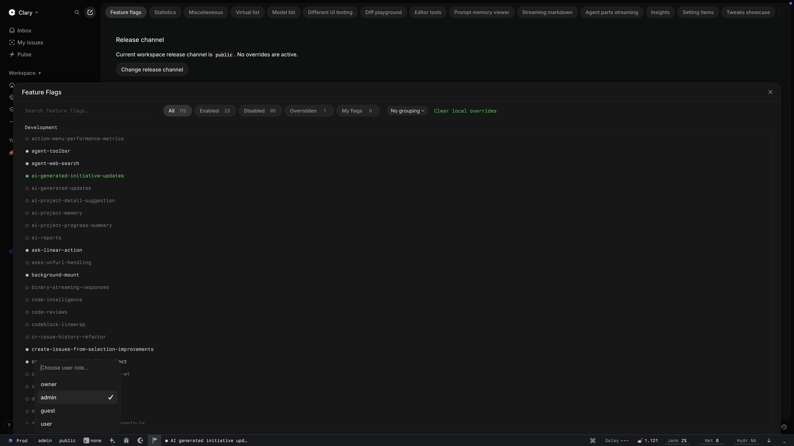

# linear dev toolbar unlock

browser extension that tricks linear into thinking you're one of their superusers, which pops up their internal development toolbar with access to feature flags and debug functionality.

## install

### chrome / edge / brave / arc

1. clone or download this repo
2. go to `chrome://extensions`, enable "Developer mode"
3. click "Load unpacked" and select the repo folder

### firefox / zen

1. clone or download this repo
2. go to `about:debugging#/runtime/this-firefox`
3. click "Load Temporary Add-on" and select `manifest.json` from the repo folder
4. note: temporary add-ons are removed when firefox restarts. for persistent installation, use [web-ext](https://extensionworkshop.com/documentation/develop/getting-started-with-web-ext/) or sign the extension

## how it works

got the idea from the [blog post about their recent redesign](https://linear.app/now/behind-the-latest-design-refresh), which included a screenshot of the toolbar. i used `npx asar extract /Applications/Linear.app/Contents/Resources/app.asar` to un-bundle their desktop client, patched it to dump all javascript loaded from their servers into a local directory, and ran claude through the dump to figure out the mechanism which shows the toolbar.

the extension patches `Array.prototype.includes` and `Object.defineProperty` to rig the superuser checks, and enables the `global-superuser` and `showDeveloperToolbarForGuest` flags in `localStorage` to enable the toolbar. unless linear intentionally takes steps to obfuscate the toolbar behavior, this approach should be resistant to future code changes.